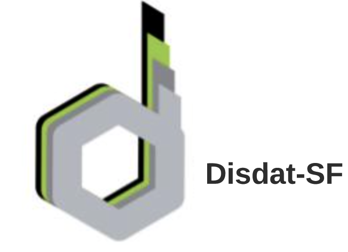
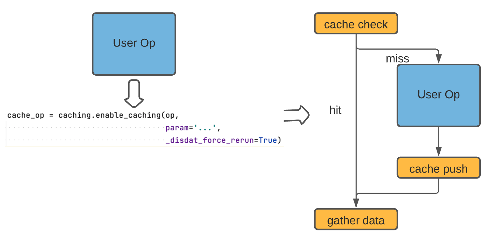
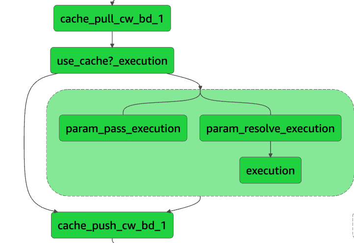

[](https://opensource.org/licenses/Apache-2.0) 
[](https://badge.fury.io/py/disdat) 

## disdat-step-functions
Disdat is a Python (3.6 +) package for data versioning and pipeline authoring that allows data scientists to create
, share, and track data products. Disdat-kfp is a plugin built upon Disdat and enables data versioning for Kubeflow Pipeline (KFP).

More specifically, this plugin does the following:
* **Caching**: Captures all intermediate outputs and reuses cached data based on task parameters.
* **Data Versioning**: All state artifacts are versioned as [bundles](https://disdat.gitbook.io/disdat-documentation/basic-concepts/bundles) on S3;
* **Minimum Intrusion**: Making it easy to refactor existing projects at pipeline level; users don't need to modify any state definitions.
* **Share Datasets**: Intermediary artifacts can be easily shared between teams with [standardized APIs](https://disdat.gitbook.io/disdat-documentation/examples/short-test-drive/push-pull-using-s3).

## Get Started 
Install the package, the pip command will also download the core disdat package if you haven't done so already. 

`pip install disdat-step-function`

Get Started with the tutorial notebook! Check out how easy it is to version a AWS StepFunction state machine in `simple_cached_sm.ipynb`

## Documentation
### `caching_wrapper.Caching`
Used to create and configure data versioning parameters that Disdat should use. You can eithe create this object and share it between 
different components (e.g, if all data go to the same location), or you can create one object for each component  
**Args** \
`caching_lambda_name`: `str`, the lambda function you created with the lambda stub generated by disdat-kfp. See `LambdaGenerator`

`context_name`: `str`, the Disdat context in which the artifacts reside  

`s3_bucket_url`: `str`, url of the S3 bucket. For instance `s3://my-bucket`

`force_rerun`: `bool`, force rerun all components if set to `True` 

`use_verbose`: `bool`, see more verbose logs if set to `True` 

`state_machine_name`: `str`, name of the state machine, reserved for future use


### `Caching().cache_step`
Given a user state, wrap it up with dynamically generated states that implements data versioning and 
smart caching. \
**Args** \
`user_step`: The step object(`sepfunctions.steps.states`) to cache 

`bundle_name`: `str`, optional, the name of the bundle to create. Default to state name

`force_rerun`: `bool`, override the pipeline-level `force_rerun`. Set to `True` to enable caching

**Return**  
`stepfunctions.steps.Chain`: a state machine with user's state embedded in

#### Example Usage 
```angular2html
from stepfunctions.steps import states
from disdat_step_function.caching_wrapper import Caching 

caching = Caching(caching_lambda_name="lambda_func_name",
                  s3_bucket_url="s3://hello",
                  context_name="simple_demo",
                  verbose=True)

user_task = states.Pass(state_id='user')
cached_task = caching.cache_step(user_task, bundle_name="simple_task", force_rerun=False,)
```
### `PipelineCaching`
Used to refactor an existing pipeline given its definition. `PipelineCaching` finds all `Task` state in the definition 
and call replace it with `Caching().cache_step(task)` (a `steps.Chain` object)

**Args** \
`defintion`: `Union[sepfunctions.steps.states.Chain, sepfunctions.steps.states.State]`, the state machine to refactor 

`caching`: `caching_wrapper.Caching`, used to cache individual states. 


### `PipelineCaching().cache`
Modify state machine `definition` in-place. The state machine now supports data versioning 

**Args** 
`None`

**Return** 
`None`

#### Example Usage 
```angular2html
from stepfunctions.steps import states
from disdat_step_function.caching_wrapper import Caching, PipelineCaching

caching = Caching(caching_lambda_name="lambda_func_name",
                  s3_bucket_url="s3://hello",
                  context_name="simple_demo",
                  verbose=True)
# define you graph normally
user_task_1 = states.Pass(state_id='task1')
user_task_2 = states.Pass(state_id='task2')
graph = states.Chain([user_task_1, user_task_2])
# one-button refactoring 
PipelineCaching(graph, caching).cache()

```

### `LambdaGenerator.generate`
Generate code and lambda layer that you can use to create a AWS Python Lambda function, which is called by
the augmented state machine to record artifacts.  
**Args**
`root`: `Union[str, pathlib.Path]`, where to dump the generated code 
`force_rerun`: `bool`, re-generate everything and overwrite existing code and zip files

**Return**
`None`

**Artifacts**
This function will generate a folder of artifacts that you can use to create appropriate caching lambda function.
```
Root 
    |- /cache_lambda
    |    -lambda_for_user.py: copy this file to a lambda function
    |    
    |- /dependency: dependencies installed in a amazonlinux container to ensure compatibility
    |
    |- disdat_caching_layer.zip: the lambda layer with all necessary dependencies
```

##  Instrumentation 
Since AWS StepFunction is essentially an orchestrator of tasks with heterogeneous runtimes, we must make sure all tasks, not just Python code, get to enjoy the benefits of data versioning. 
Hence, disdat-step-function injects states before/after user state to pull/push data to S3 (from now on they are called caching steps).  
 

To enable data versioning and caching for a state, simply use the `cache_step()` wrapper and pass in the state obj. If you 
have a complex state machine with many states, you can also use `PipelineCaching().cache` to one-button refactor 
the whole workflow. 

As you can see in the figure above, disdat-step-function injects some states around user's designated task. The component name and input parameters 
are used to uniquely identify an execution. Note that you should not use disdat-step-function for tasks that are not idempotent. 

With some high-level understanding of how Disdat-step-function works, let's dive into the actual diagram
 


### `cache_pull_{task_name}`
It takes the input json file and extract the parameters using the `input_path` field selector specified by the user's task. 
Once it has the parameters, a `proce_name` will be calculated using bundle name and the hash of the parameters. This key value 
will be used to pull data from the remote disdat bundle on S3 

The output of `cache_pull` has the following format:

**Output**
```angular2html
{
    # the full param will be passed to user state
  "_full_params": input_data

    # the cache param will be passed to cache push 
  "_cache_params": input_data[field_selector]

    # data to pass on to the next state if cache hit 
  "_data": cached_data/null,

    # execute user state or not 
  "_use_cache": false/true
}
```

### `param_pass_{task_name}` 
In AWS State Machine, any state can only take parameters from another state. In order for the input parmaters to reach `cache_push`, 
we must create a bypass. The output of `param_pass` has the following format:

**Output**
```angular2html
{
  "_cache_params": input_data[field_selector]
}
```
### `param_resolve_{task_name}` 
Since the user state expects the input data to be the parameters `cache_pull` receives, we must unravel the output of `cache_pull` using 
field selection `$._full_params`. Hence, `param_resolve` has the following output format:


**Output**
```angular2html
input_data 
```

### `cache_push_{bundle_name}`
If it receives data from `cache_pull` (no execution), it will simply pass on the `_data` field to the following state

If it receives data from the execution branchm it will use `_cache_param` to calculate proc_name and push data to S3

**Output**
```angular2html
data output by user task
```

## Lineage Capture 
Data provenance is an important feature of data versioning. This is especially true for orchestration workflows such as AWS StepFunction. However,
due to the design nature of SF, it is very hard for a state to figure out what its parent is. We leverage the execution logs and build a graph in which 
each node is an execution event. Unfortunately the execution flow is hard to reconstruct from raw logs (especially true for Parallel and Map states). 
Right now we support partial lineage, that is for every cached state, we guarantee to find one parent 
(some states may have multile parents, such as the state following a parallel state with two branches)

**Importance Tips**
>If you need to enable lineage capture, please make sure your Lambda  
can perform `list_state_machines`, `list_executions` and `get_execution_history` on StateMachines
>
> Lineage capture only supports default bundle names. This is because 
> we can only recover bundle name from execution event name if bundle name = task name

**Warning**
>Lineage capture is still in alpha mode, use it at your own risk (captured dependencies are correct, but some will be missed).
> By default this feature is disabled. To enable it, modify the `lambda_for_user.py` code:

```angular2html
parent = cache.get_lineage()
# parent = None
return cache.cache_push(event, parent)
```